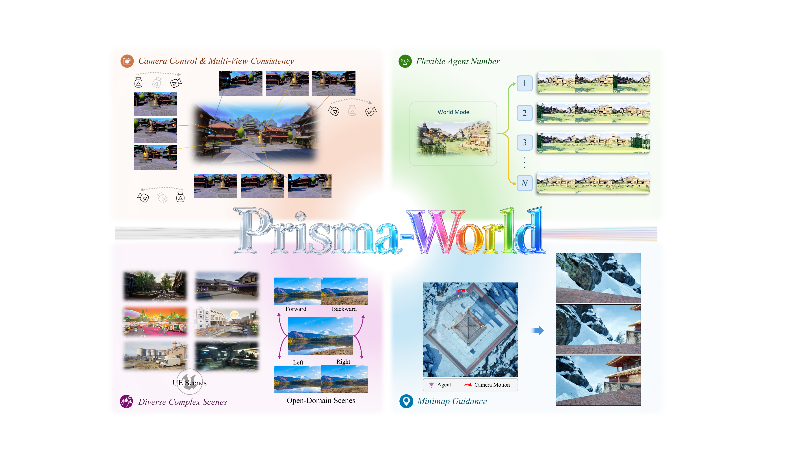

# Prisma-World

**Prisma-World: Camera-Controllable Multi-Agent Video World Model**

Prisma-World is a camera-controllable multi-agent video world model for generating synchronized videos for a variable number of agents. The model performs multi-agent generation within a unified denoising process, supports camera-aware cross-view consistency, and can use minimap guidance for spatial grounding.

> Code and model release are being prepared. This repository currently serves as the public index for the project, paper, and visual materials.

## Links

- **Project page:** https://huiqiang-sun.github.io/prisma-world/
- **Paper:** https://huiqiang-sun.github.io/prisma-world/prisma-world.pdf


## Overview



- **Camera-controllable generation:** each agent can follow a specified camera trajectory.
- **Multi-view consistency:** related views are generated jointly to preserve shared scene content.
- **Variable agent number:** the same framework supports different numbers of generated agents.
- **Diverse scenes:** results cover structured UE scenes and open-domain environments.
- **Minimap guidance:** top-down local maps can provide additional spatial conditioning.


## Citation

```bibtex
@article{prismaworld2026,
  title={Prisma-World: Camera-Controllable Multi-Agent Video World Model},
  author={Huiqiang Sun and Zhan Peng and Size Wu and Kun Wang and Kang Liao and Dianyi Wang and Xingyu Zeng and Sheng Jin and Yangguang Li and Zhiguo Cao and Ziwei Liu and Wei Li},
  journal={arXiv preprint},
  year={2026}
}
```

